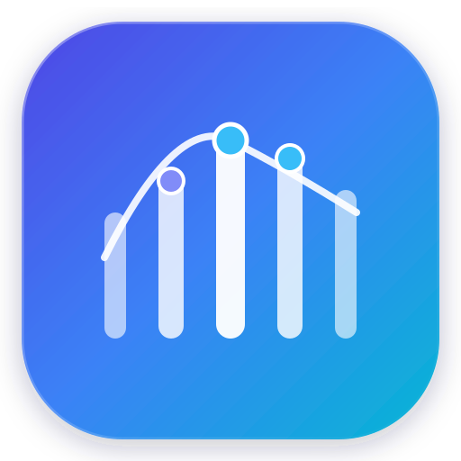
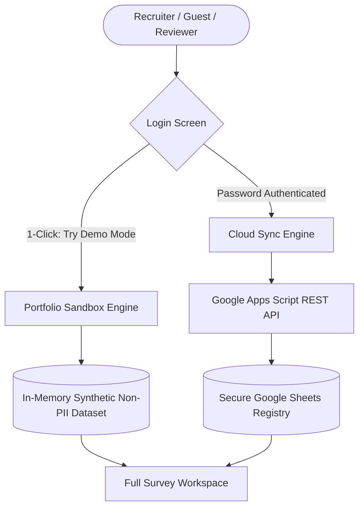

# CensusConnect — Field Demographic Data Collection & Socio-Economic Registry

<p align="center">
  
</p>

<p align="center">
  <strong>A resilient, mobile-first Progressive Web App (PWA) designed for field demographic surveys, multi-tier household mapping, and socio-economic registry management.</strong>
</p>

<p align="center">
  
  
  
  
  
</p>

---

## 📌 Overview

**CensusConnect** is an operational survey suite built for field enumerators, statistical surveyors, and municipal administrators. Designed specifically for mobile field workflows and low-connectivity environments, it streamlines the capture of hierarchical building structures, household units, demographic indicators, socio-economic classifications, and living amenity access.
---

## 🔒 Dual-Mode Architecture

To allow seamless public portfolio evaluation while protecting private citizen data, CensusConnect features a decoupled dual-mode runtime:



1. **Portfolio Sandbox Mode**:
   - 1-click access via the **"Try Demo Mode"** button (or `?demo=true`).
   - Uses an isolated in-memory synthetic dataset — **zero real citizen PII is exposed**.
   - Full CRUD capability (Add buildings, add household units, search, edit, delete).
2. **Live Production Mode**:
   - Guarded by backend password verification.
   - Synchronizes records in real time with Google Sheets via a Google Apps Script Web App.

---

## 🌐 Dual-Language Internationalization (`i18n`)

One-click instant UI translation between **English** and **हिन्दी**:
- All questionnaire section titles, dropdown choices, validation hints, status pills, and system toasts update dynamically without reloading the page.

---

## 🛠️ Technology Stack

| Layer | Solution | Description |
| :--- | :--- | :--- |
| **Frontend Core** | Vanilla HTML5, ES6+ JavaScript, CSS3 | Zero dependencies, instant loading, no bundler overhead |
| **PWA Architecture** | Service Worker (`sw.js`) + Web App Manifest | Offline shell caching and standalone installation |
| **Design System** | Custom CSS Variables & Glassmorphism | Clean, accessible SaaS design with responsive touch targets |
| **Icons** | Lucide Icons (SVG) | Crisp, uniform vector icons |
| **Cloud Storage** | Google Apps Script REST Web App + Google Sheets | Serverless, zero-maintenance relational spreadsheet backend |
| **Deployment** | Vercel | Global edge CDN static delivery |

---

## 📂 Project Structure

```text
├── index.html        # Single-page application markup & navigation
├── style.css         # Modern CSS tokens, responsive grid & touch UI styles
├── app.js            # Questionnaire engine, i18n dictionary, sandbox & sync
├── sw.js             # Service worker for offline shell caching (v5)
├── manifest.json     # Progressive Web App configuration
├── logo.svg          # Demographic pillar vector emblem
├── Logo.png          # App icon for PWA splash screens
├── .gitignore        # Git exclusion rules
└── README.md         # Documentation
```

---

## 🚀 Quickstart & Local Setup

Because CensusConnect uses standard web standards with zero build dependencies, running it locally is instant:

```bash
# 1. Clone the repository
git clone https://github.com/your-username/census-connect.git

# 2. Open the directory
cd census-connect

# 3. Serve with any HTTP server (or open index.html directly)
python -m http.server 3000
# or: npx serve .
```

Navigate to `http://localhost:3000` in your browser.

---

## ☁️ Deploying to Vercel

1. Push your repository to GitHub.
2. Import the repo into [Vercel](https://vercel.com).
3. Set **Framework Preset** to `Other` (Static HTML).
4. Click **Deploy** — your app will be live globally in seconds.

---

## 📄 License

This project is open source and available under the [MIT License](LICENSE).
